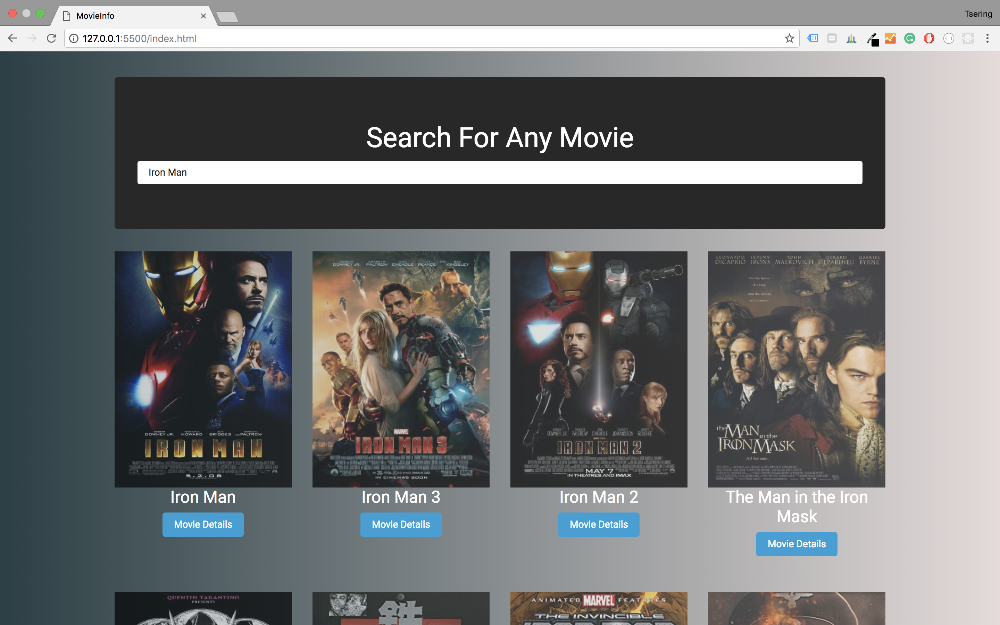

# MovieInfo App
JavaScript/jQuery app that fetches movie data from the OMDb API

## Run Local Server
```bash
$npm install -g live-server
$live-server
```

## Mobile


# Technologies Used
* API (https://www.omdbapi.com)
* Api Key= "http://www.omdbapi.com/?s=" + query + "&apikey=thewdb"
* Live server npn (https://www.npmjs.com/package/live-server)
* Bootstrap theme Bootswatch (https://bootswatch.com/4/cyborg/bootstrap.min.css)
* Jquery (https://code.jquery.com/)
* Axiox (https://www.npmjs.com/package/axios)
* Youtube Lesson(https://www.youtube.com/watch?v=YsPqjYGauns&t=1166s)


